# OS review: Question and Answer

> Author: 钟庸 Yong Zhong

table of contents

- [2. OS Basics](#ii-os-basics)
- [3. Processes](#iii-processes)
- [4. Scheduling](#iv-scheduling)
- [5. Synchronization](#v-synchronization)
- [6. Deadlock](#vi-deadlock)

- [7. Address Translation](#vii-address-translation)
- [8. Paging](#viii-paging)
- [9. Demand Paging](#ix-demand-paging)
- [10. Linux Memory Management](#x-linux-memory-management)
- [11. IO and Storage](#xi-io-and-storage)
- [12. File System](#xii-file-system)

---

## II. OS Basics

### Dual Mode Operation

1. Why is dual-mode needed?
    > Separation of privilege to protect the OS from malicious user programs. User mode has limited access to hardware resources, while kernel mode has full access.

2. What is needed in the hardware to support “dual mode” operation?
    > - A mode bit in the CPU to indicate the current mode (user or kernel).
    > - In x86 (intel & arm): Ring 0 (kernel), Ring 3 (user)
    > - In RISC-V: U mode (user), S mode (supervisor), M mode (machine)

3. Draw the graph of Unix system structure. You should include the layers and the interfaces in between.
    > 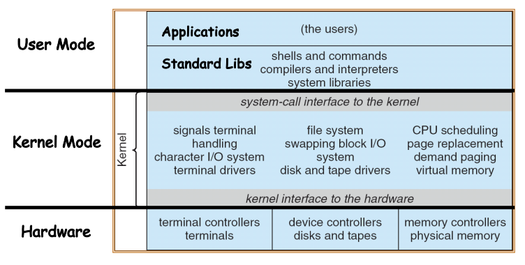

4. What are the 3 ways to transit from user mode to kernel mode? Explain each.
    > 1. **System call**: Kernel services provided to user programs. Invoke by system call number.
    > 2. **Interrupt**: Asynchronous. I/O.
    > 3. **Exception**: Synchronous. (divide by zero, invalid memory access, etc.)

5. Give 3 types of system calls, each with an Unix syscall example.
    > - **Process control**: fork(), exec(), exit()
    > - **File manipulation**: open(), read(), write(), close()
    > - **Information maintenance**: getpid(), alarm(), sleep()

6. Name 3 exception:
    > - **Divide by zero**
    > - **Invalid memory access**: page fault
    > - **Map the swapped-out page back to memory**: demand paging

7. Name 3 interrupts:
    > - **Notification from device**: I/O completion.
    > - **Preemptive scheduling**: clock timer interrupt every time slice to enable kernel scheduling.
    > - **Notification from another CPU**: IPI (inter-processor interrupt) to wake up other CPU.

8. Does user application code know the address of the system call functions? If not, how does it specify which system call to invoke?
    > No. User code invoke syscall by passing id and args to registers (e.g., in RISC-V, a7 for syscall number, a0-a6 for args).

9. What are the differences and similarities between interrupts and exceptions?
    > Diff:
    > - Exceptions are synchronous, react to abnormal conditions.
    > - Interrupts are asynchronous, preemt normal execution.
    >
    > Sim:
    > - Both use IDT to map to handler functions.
    > - They share the same procedure:
    > 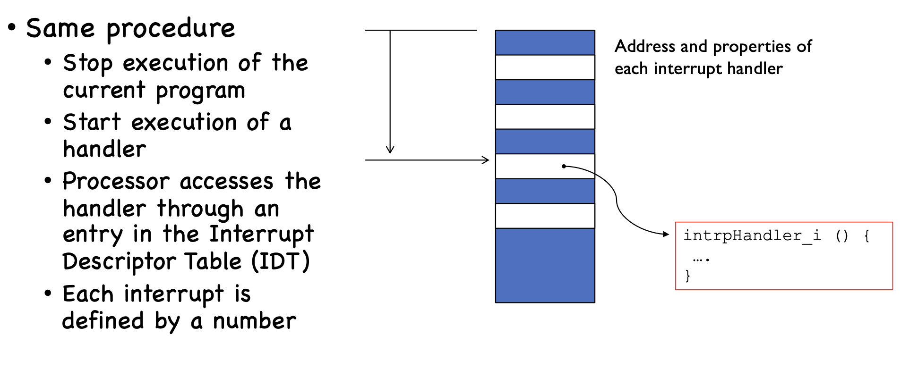

### Kernel Structure

1. Explain monolithic kernel and microkernel. What are the pros and cons of each?
    > - **Monolithic kernel**: All OS services run in kernel space.
    >   - Pros: fast, no context switch between user and kernel for OS services.
    >   - Cons: large codebase, hard to maintain, less secure.
    >
    > - **Microkernel**: Protection mechanisms stay in kernel while resource management policies go to the user-level servers (e.g., file server, user memory server, etc.).
    >   - Pros:
    >     - Better responsiveness. (preemtive scheduling of user mode services)
    >     - Better security and reliability.
    >     - Suitable for distributed OS and concurrency. (no need lock)
    >   - Cons: slower due to more IPC thus more context switches.

2. Explain framekernel
    > 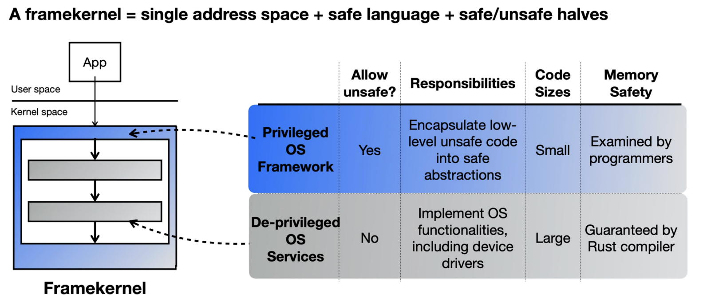

3. What is hypervisor?
    > Also called Virtual Machine Monitor (VMM), focusing on isolation and virtualization. It is a thin layer of software that runs directly on the hardware and manages multiple virtual machines (VMs). Each VM runs its own OS and applications, sharing the underlying hardware resources.

4. What are the design principles of OS? (user, system)
    > - User: Convenience, Fast, Reliable.
    > - System: Easy to design, implement and maintain, Flexible, Efficient.

5. What is the difference between policy and mechanism?
    > - Policy: high level, which component is responsible for what task.
    > - Mechanism: low level, the implementation, what data structures and algorithms to use.

### OS Services

1. Name 3 OS services.
    > 

2. What does system programs provide? Name 3 examples.
    > System programs provide a convenient environment for program development and execution.
    > - file manipulation
    > - status information
    > - programming language support
    > - Program loading and execution
    > - Communications

## III. Processes

### Process

1. What is a process?
    > - Process is program in execution.
    > - Process is an abstraction of machine states.
    >   - Adress space: abstraction of memory.
    >   - Files: abstraction of I/O devices.
    >   - Registers

2. What's the difference between a program and a process?
    > - Program: code and static data on disk.
    > - Process: loaded program in memory, with stack and heap created by OS.

3. Draw the diagram of process state transition. Explain each state and transition.
    > 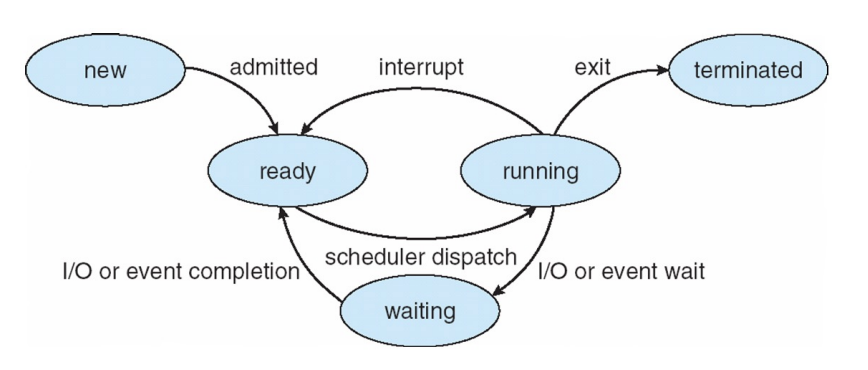
    > 
    > > states:
    > - new: process is being created.
    > - ready: process is waiting to be scheduled.
    > - running: process is being executed.
    > - waiting: process is waiting for an event (I/O completion, signal).
    > - terminated: process has finished execution.
    > > transitions:
    > - admit: OS check if a process is ok to schedule.
    > - scheduler dispatch: context switch to the selected process.
    > - I/O or event wait: process requests I/O or waits for an event (signal).
    > - I/O or event completion: I/O or event is completed, reschedule the process.
    > interrupt: clock timer interrupt, or a high priority process is awakened by bottom half driver, or IPI from other CPU core.
    > - exit: process finishes execution.

4. Why a process in waiting cannot directly go to running?
    > We need a universal scheduler to decide which process to run next. A process in waiting must go to ready state first, then the scheduler will decide when to dispatch it to running state.

### system calls

1. What are the 3 ways of passing parameters of syscall?
    > - **Register**: in x86 and risc-v
    > - **Block**: Memory block.
    > - **Stack**: process push onto stack, OS pop from stack.

2. Why do we need library calls? Name some library calls and syscalls respectively.
    > Abstraction of syscalls. Programming-friendly. Library calls will invoke syscalls.
    > fopen("file.txt", "r") calls open("file.txt", O_RDONLY) syscall
    > fopen() -> open() 
    > fread() -> read()

### Process creation

1. Explain the possible return values of fork().
    > pid: in parent process, return child pid.
    > 0: in child process.
    > -1: error.

2. What will be duplicated in fork()? What will not?
    > > Duplicated:
    > - Registers (e.g. PC, hence both continue from the next instruction after fork())
    > - Memory (code, data, heap, stack)
    > - Files: same fd.
    > > Not duplicated:
    > - PID: child has a new pid.
    > - Parent
    > - return value of fork()
    > etc.

3. Will exec() return to the caller? Why?
    > No. The new process will exit directly thus not return to the caller.

4. Will wait() wait for all child processes? How to wait for a specific child process? How to wait for all child processes?
    > - wait() only wait for 1 child process
    > - use waitpid(pid, &status, options) to wait for a specific child process.
    > - use a loop to call wait() until it returns -1. Remember to pair up wait() with fork().

5. How does child process wake up parent process after child terminates?
    > Child process sends SIGCHLD signal to parent process, which turns parent from WAITING to READY state.

### Kernel view of processes

1. What info is stored in PCB? Name a few.
    > - Process state (running, waiting, etc.)
    > - Program counter PC
    > - Memory management info (page table base register cr3, etc.)
    > - Accounting info (CPU usage, time limits, etc.)
    > - I/O status info (open file descriptors, etc.)
    > - PID
    > - parent PCB pointer

2. How is PCB organized in memory? Explain ready queue and device queue.
    > - PCB is stored in kernel space. Organized as linked list (e.g. task list is a double linked list).
    > - Ready queue: linked list of PCBs in READY state.
    > - Device queue: linked list of PCBs in WAITING state for a particular I/O device. Fore each I/O device, there is a separate device queue.

3. Explain cooperate switching and non-cooperate switching.
    > - Coorperative scheduling: OS will have to wait
    > - Non-cooperate scheduling: timer interrupt

4. What will OS do during its regaining control of CPU?
    > - Handle syscall, interrupt, exception.
    > - Schedule next process using CPU scheduler.
    > - Perform context switch if needed.

5. What will happen during context switch?
    > 1. Store the context (registers, PC, etc.) of the currently running process into its PCB.
    > 2. Load the context of the next process from its PCB into the CPU registers.

### Kernel view of fork(), exec(), and wait()

1. What will happen if parent and child write into the same memory address after fork when using COW? What about writing to the same file?
    > >COW:
    > - initially, share the same physical page. Either process attempts to write to that page -> page fault.
    > - Page fault handler:
    >   - allocates a new physical page for the writing process
    >   - copies the contents pld -> new
    >   - update page table, flush TLB.
    > - each process gets its own copy thus modifications do not affect each other.
    > > File:
    > - Both processes share the same fd, thus writing to the same file will affect each other. Modifications will be seen by both processes.

2. What is zombie process?
    > After child process terminates, its PCB is still kept in the OS to store exit status and other info until the parent process calls wait() to read the exit status. During this time, the child process is called a zombie process.

3. exit() and wait() is responsible for which resources clean up or routines respectively?
    > - exit():
    >   - Close files
    >   - Free memory in user space
    >   - Notify parent process (send SIGCHLD)
    > - wait():
    >   - Free PCB in kernel space
    >   - Remove it from process table, task list etc.

4. Review the difference between wait() called before child exits and after child exits.
    > > wait() called before child exits:
    > 1. During wait() is called, Kernel register a default handler for SIGCHLD to wake up parent when child exits.
    > 2. Since parent is waiting for the child, defualt handling routine is invoked. It removes SIGCHLD signal and remove child PCB.
    > 3. The kernel deregister the handler. Parent will ignore child since no handler is registered.
    > 
    > > wait() called after child exits:
    > 1. The parent ignores his child since it is not waiting.
    > 2. When wait() is finally called, kernel sets the signal handling routine and found SIGCHLD is already there.
    > 3. Do the clening up immediately.

5. The code snippet below shows the severe consequence of not killing zombie. Explain why it is harmful.

```c
int main(void) {
    while( fork() );
    return 0;
}
```

> The code continuously creates child processes using fork(), however parent never calls wait(). As more and more zombies accumulate, they consume system resources (like PCB entries), eventually leading to resource exhaustion.

### More about processes

1. Which syscall is responsible for re-parenting?
    > exit(). During parent exit(), it re-parents its children to init process (pid 1).

2. Explain background jobs.
    > It allows a process runs without a parent terminal/shell. Supported by re-parenting to init process.

3. When will real time > user + sys time? When will real time < user + sys time?
    > - Real time: wall clock time from start to finish.
    > - User time: CPU time spent on codes in user-space memory.
    > - Sys time: CPU time spent on codes in kernel-space memory.
    >
    > Real time > user + sys time:
    > - Process is waiting for I/O or other events.
    > - Context switch other process.
    >
    > Real time < user + sys time:
    > - Multi-core CPU: multiple threads of the same process run in parallel on different cores.

## IV. Scheduling

1. Explain CPU-bounded and I/O-bounded processes.
    > - CPU-bounded: spend most of their time doing computations (inuser mode). user time > sys time
    > - I/O-bounded: spend most of their time waiting for I/O operations (in kernel mode). sys time > user time

2. What are the criteria of CPU scheduling?
    > - Opimize Turnaround time: block / terminiate time - arrival time
    > - Opimize Waiting time: accumulative time waiting in ready queue
    > - Responsiveness: first run time - arrival time
    > - Aside, consider context switch overhead.

3. During which transitions can scheduling happen? Based on that, explain preemptive and non-preemptive scheduling.
    > 1. ready -> running
    > 2. running -> ready
    > 3. waiting -> ready
    > 4. terminate
    >
    > - Non-preemptive scheduling: only schedule during 1 and 4.
    > - Preemptive scheduling: other are preemptive.
    >   - (e.g. 2: timer interrupt in RR scheduling, 3: high priority process wakes up from I/O completion thus preempt current low priority process in running)

4. Explain SJF.
    > - None-preemptive: Schedule by total CPU time.
    > - Preemptive: Schedule by remaining CPU time.

5. Explain RR.
    > - preemptive
    > - quantum: time slice
    > - maintain a queue. If a process used up quantum, move it to the back of the queue and re-charge its quantum. In comming process is added to the back of the queue.
    > - bad turnaround time and waiting time, but better responsiveness.

6. Explain Priority Scheduling.
    > - priority: integer value, smaller value means higher priority.
    > - static priority and dynamic priority.
    > - starvation: low priority process may never get scheduled.
    > - Aging: gradually increase the priority of waiting processes to prevent starvation.

## V. Synchronization

### Race condition & Critical Section

1. Explain race condition.
    > >The outcome of the execution depends on a particular order where sahred resources are accessed.
    > - Order
    > - Shared resources

2. What are the 3 requirements for critical section implementation?
    > 1. **Mutual Exclusion**: Only one process can be in critical section at a time.
    > 2. **Bounded waiting**: Prevent starvation. As a process requests to enter, the number of times of other processes entering is bounded.
    > 3. **Progress**: Efficiency. If there's no process in critical section, then process requesting to enter must be allowed to enter.

### Disable Preemption & Spin-based Lock

1. Expalin when will disable interrupt work for mutual exclusion?
    > - Single-core CPU:
    >   - User mode: not permitted, need interrupt for security.
    >   - Kernel mode: permitted, correct, can ensure mutual exclusion.
    > - Multi-core CPU: Incorrect, disable interrupt dosen't affect other cores.
2. Why do we need atomic instructions? Are all the instructions in critical section atomic?
    > - Lock itself is a shared resource. Requiring lock is a race condition. Hence, hardware support is needed to ensure atomicity of lock operations.
    > - Not all instructions in critical section are atomic. Only for lock operations.

3. Explain strict alternating.
    > - In basic spin-lock, only use `turn`. Even process 0 does not want to enter critical section, process 1 has to give turn to process 0.

4. Explain progress violation in spin-based lock.
    > - If p1 has a slow remainder section after exiting cs, p0 cannot enter cs even if it wants to.

5. Why can Peterson's solution guarantee progress and bounded waiting?
    > Suppose p0 just called unlock, p1 in its while loop waiting.
    > - if p1 runs first, interested[0] = false, it can enter cs directly.
    > - if p0 runs first, it sets turn = 1, so p0 starts waiting. After context switch to p1, p1 found turn = 1 and can enter cs.
    >
    > Therefore, if p1 wants to enter cs, p0 can enter cs at most once.

6. Is peterson's algorithm correct if line 7 and line 8 are switched? 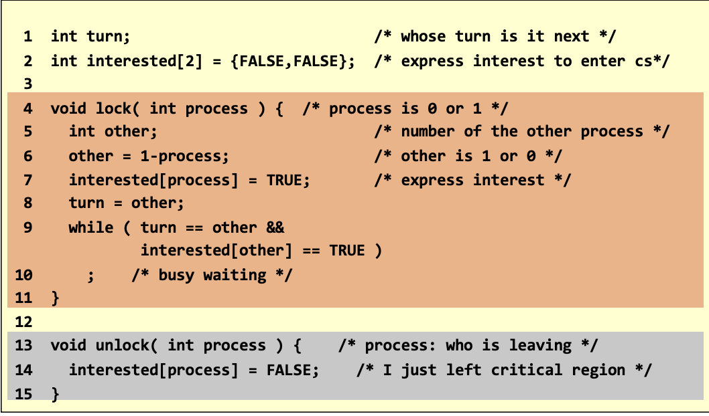
    > No. It will break the mutual exclusion req.
    > 1. p0 sets turn = 1, context switch to p1.
    > 2. p1 sets turn = 0, interest[1] = true, p1 enter cs since p0 is not interested.
    > 3. context switch to p0, interest[0] = true. Since turn = 0, p0 enter cs.

7. Explain priority inversion. How to solve it?
    > It needs at least 3 processes:
    > - A < B < C (priority), only A and C need the lock.
    > 1. A runs first and holds lock.
    > 2. C arrived, it preempts A and tries to acquire the lock, but blocked. A continues running.
    > 3. B arrived, it preempts A. After B exit, A runs again and finally release the lock.
    > 4. C eventually runs.
    >
    > The problem here is that B runs before C, even though C has higher priority than B.
    >
    > Solution: Priority inheritance. When C is blocked by A, A temporarily inherits C's priority. Thus B cannot preempt A.

### Sleep-based Lock

1. Explain semophore, include semaphore struct and PV operations.
    > - Semaphore: integer variable to control access to shared resources.
    > - struct:
    >   - a int value: number of available resources.
    >   - a queue of processes waiting for the semaphore.
    > - P (sem_wait) operation:
    >   - sem->value--;
    >   - if sem->value < 0, block the process and add it to sem->queue.
    > - V (sem_signal) operation:
    >   - sem->value++;
    >   - if sem->value <= 0, remove a process from sem->queue and wake it up.

2. Suppose we are using binary semaphore. What's the initial value of sem->value? Now that sem->value = v, what dose it mean if v < 0, v = 0, v > 0?
    > - Initial value: 1.
    > - v > 0: no one is waiting, no one wants to get into cs.
    > - v = 0: no one is waiting, only 1 process want to get in and it can get in.
    > - v < 0: |v| processes are waiting to get into cs.

### Producer-consumer problem

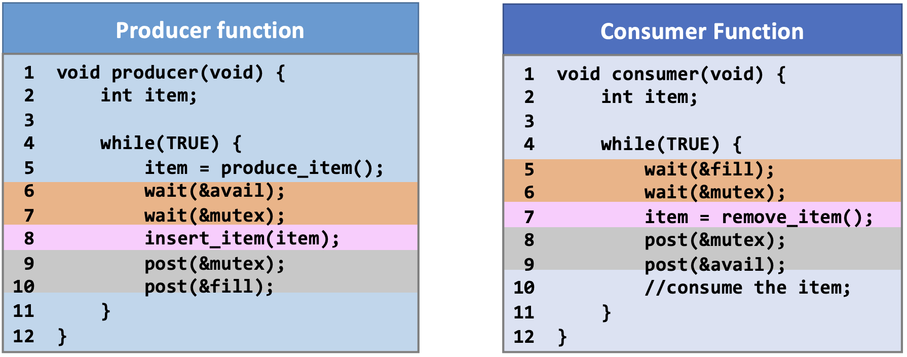

1. How many semaphores are needed in producer-consumer problem? Explain each semaphore's purpose.
    > 3 semaphores:
    > - **mutex**: binary semaphore for mutual exclusion when accessing the buffer.
    > - **fill**: counting semaphore to track the number of filled slots in the buffer. Initialized to 0.
    > - **avail**: counting semaphore to track the number of available slots in the buffer. Initialized to buffer size.

2. Which line of code is responsible of waking up producer? Which line of code will put a consumer to sleep?
    > - consumer line 9: post(&avail) may wake up a sleeping producer.
    > - consumer line 5: wait(&fill) may put consumer to sleep.

3. What if fill semophore is not used? (producer line10 and consumer line 5 removed)
    > Underflow may happen. Consumer may try to consume from an empty buffer.

4. Can we swap wait(&avail) and wait ait(&mutex)?
    > Deadlock may happen: producer may never wake up and consumer may never enter cs.
    > - producer waits for consumer post(&avail), and sleeps with a mutex lock.
    > - consumer waits for producer to release mutex, but producer is sleeping.

### Dining philosopher problem

1. Is it a good idea to use chopstick as semophore? Why?
    > No. It may lead to deadlock and starvation. If all philosophers pick up their left chopstick simultaneously, they will all wait indefinitely for the right chopstick.

    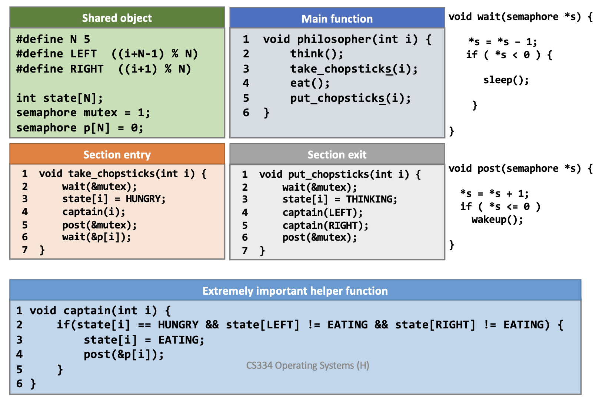

2. How many somephores are needed if use philosophers as semophore? Explain each semaphore's purpose.
    > 1 + N semaphores:
    > - **mutex**: binary semaphore for mutual exclusion when accessing the state array.
    > - **s[N]**: array of semaphores, one for each philosopher, initialized to 0. Used to block philosophers when they cannot eat.

3. What is the invsible captain responsible for?
    > A philosopher can only eat if LEFT and RIGHT philosophers are not eating and itself is HUNGRY.

4. What dose p[i] == 0, p[i] == -1 mean?
    > - p[i] == 0: philosopher i ready.
    > - p[i] == -1: philosopher i blocked.

5. Is it ok to swap line 4 (captain(i)) and line 5 (post(&mutex)) in entry?
    > No. It will break mutual exclusion. A philosopher may accidentally eat twice.

6. What will happen in entry and exit?
    > - **Entry**: try to aqcuire mutex, then set itself to hungry, invoke captain on itself, drop mutex. Process is either allowed to eat or sleep when return.
    > - **Exit**: try to acquire mutex, then set itself to thinking, invoke captain on LEFT and RIGHT philosophers, drop mutex.

## VI. Deadlock

### Basic Concepts

1. What's tehe relationship between deadlock and starvation?
    > Deadlock -> Starvation, but not vice versa.

2. What are the 4 requirements for deadlock?
    > 1. **Mutual exclusion**: At least one resource must be held in a non-sharable mode.
    > 2. **Hold and wait**: A process holding at least one resource is waiting to acquire additional resources held by other processes.
    > 3. **No preemption**: Resources cannot be forcibly removed from processes holding them until the resources are used to completion.
    > 4. **Circular wait**: A set of processes are waiting for each other in a circular chain.

### Detection

1. What are the shape and meaning of Available, Allocatoin, Request?
    > m: number of resource types, n: number of processes.
    > - **Available**: 1 x m vector. Available[j] indicates the number of available instances of resource type j.
    > - **Allocation**: n x m matrix. Allocation[i][j] indicates the number of instances of resource type j currently allocated to process i.
    > - **Request**: n x m matrix. Request[i][j] indicates the number of instances of resource type j that process i is currently requesting.

2. What does work and finish mean? What are they initialized to?
    > - **work**: 1 x m vector. Represents the number of available resources currently. Initialized to Available.
    > - **finish**: n-element boolean array. Indicates whether process i can finish with the current work resources. Initialized to false for all processes.

3. Explain the deadlock detection algorithm.
    > 1. Initialization: Initialize work = Available, finish[i] = false for all i.
    > 2. Find finishable process: Find an index i such that finish[i] == false and Request[i] <= work. If no such i exists, go to step 4.
    > 3. Free resources: work = work + Allocation[i]; finish[i] = true; go to step 2.
    > 4. Ending: If finish[i] == false for some i, then process i is deadlocked.

4. What actions may be taken after deadlock is detected?
    > - Terminiate process
    > - Preemption temporarily
    > - Rollback (in databases)

### Prevention

1. In banker's algorithm, which requirements of deadlock is prevented?
    > - **Mutual exclusion**: not prevented.
    > - **Hold and wait**: prevented. Process must request all resources at once.
    > - **No preemption**: not prevented.
    > - **Circular wait**: prevented. Impose an ordering on resource types and require processes to request resources in increasing order of enumeration.

2. Explain safe state and unsafe state.
    > - **Safe state**: There exists a sequence of processes such that each process can obtain its maximum resources and complete.
    > - **Unsafe state**: No such sequence exists. The system may enter deadlock if processes request resources in a certain order.

3. Explain safety algorithm.
    > Simply change `request` in deadlock detection algorithm to `need` (max - allocation).

4. Explain resource-allocation graph and how to prevent deadlock with it.
    > process i is requesting a set of resources
    > 1. If requst_i <= Need, continue to step 2. Else, error.
    > 2. If request_i <= Available, continue to step 3. Else, wait.
    > 3. Pretend to allocate requested resources to process i:
    >       - Available = Available - request_i
    >       - Allocation_i = Allocation_i + request_i
    >       - Need_i = Need_i - request_i
    > 4. Use safety algorithm to check if the system is in safe state. If safe, grant the request. Else, rollback to previous state and make process i wait.

## VII. Address Translation

### Memory Virtualization

1. Is the virtual address space size the same as the physical address space size? Why?
    > No. The virtual address space can be larger than the physical address. The virtual address space is an abstraction that allows each process to have its own address space, while the physical address space is limited by the actual hardware memory available.
    > 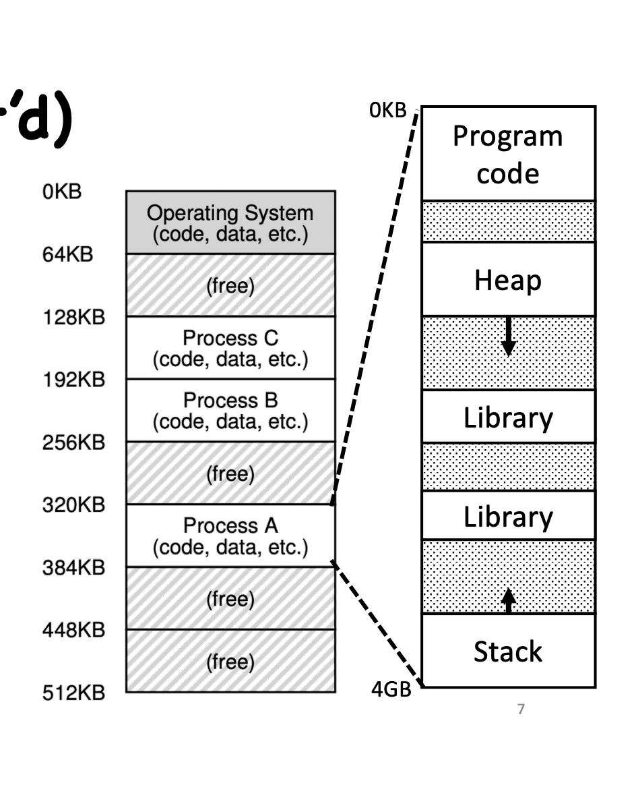

2. Name the requirements for memory virtualization and explain them.
    > 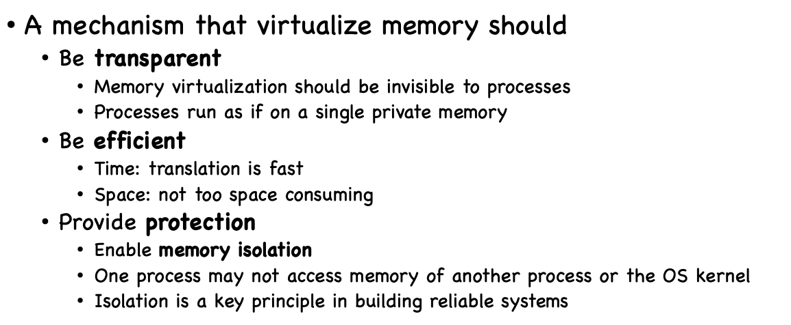

3. Where is the translation from virtual address to physical address performed? What hardwares are involved?
    > The translation is performed by the Memory Management Unit (MMU) in the CPU. With paging allocation, the MMU will use the page table to map virtual addresses to physical addresses. After translation, the physical address is sent to the DRAM through memory bus to access the data.
    > 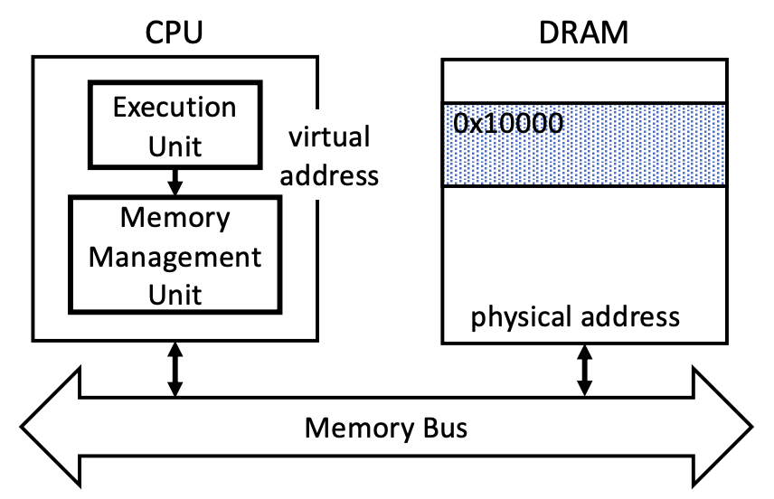

4. During the address translation, what is the role of hardware and what is the role of software (OS)?
    > 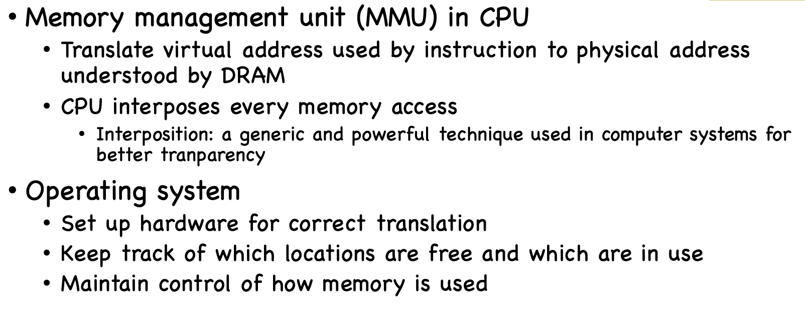
    > 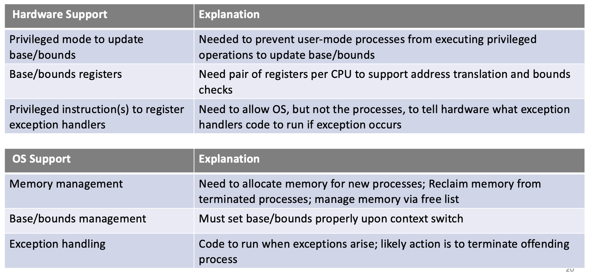

### Base and Bounds

1. Is base and bounds bind to process or to system? Why?
    > Process. Because each process has its own base and bounds registers to define its own address space.

2. Explain the base and bounds translation mechanism.
    > 1. **Compare**: The virtual address is compared with the bounds register to check if it is within the valid range.
    > 2. **Translate**: If valid, the base register value is added to the virtual address to get the physical address.

3. What are the Limitations of base and bounds mechanism?
    > 1. **Internal fragmentation**
    > 2. **Fixed size**
    > 3. **No sharing**
    > 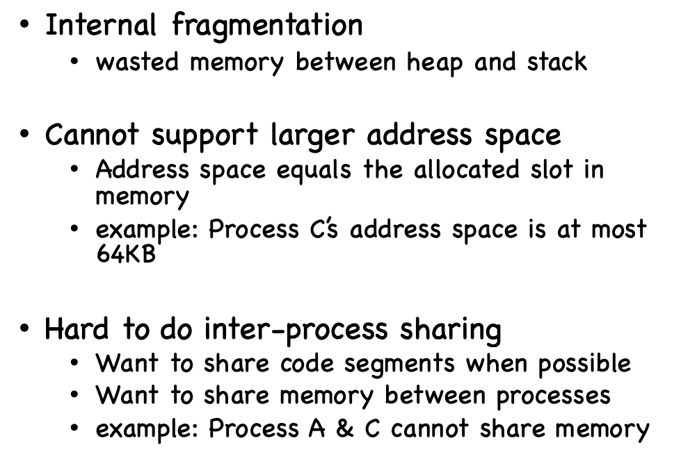

### Segmentation

1. Explain segmentation mechanism. What is the SegID used for? (hint: it is called enhanced base and bounds) (think: Is the base and bounds bind to process or to segment?)
    > Memory layout of a process is divided into Code, Data, Heap, Stack segments. Each segment has its own base and bounds registers. The SegID is used to identify which segment the virtual address belongs to.

2. Is the translation for stack segment different from the segment for heap and code? How?
   > 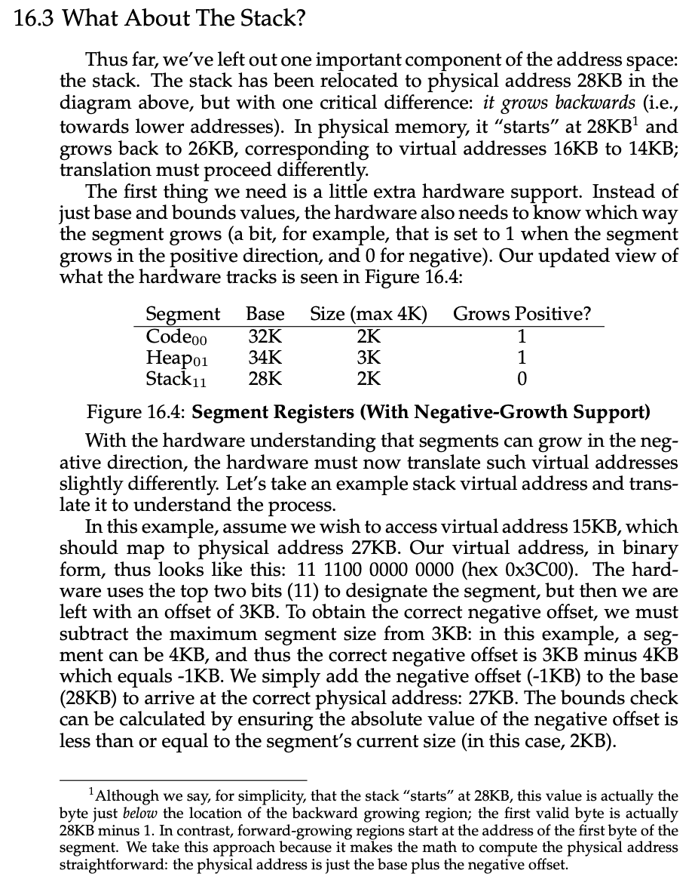

3. What are the advantages of segmentation over base and bounds mechanism?
    > 1. **No Internal Fragmentation**
    > 2. **Dynamic size**: Stack and heap segments can grow and shrink as needed.
    > 3. **Sharing**: Code segment can be shared among processes.

4. What are the disadvantages of segmentation?
   > 1. **Context switch store more registers**
   > 2. **Segmentation grow**
   > 3. **Management of variable-sized segments**
   > 4. **External fragmentation**
   > 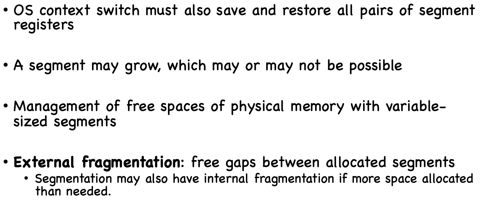

5. How is the protection implemented in segmentation?
    > Reserve bits in the segment table entry for protection (read, write, execute).
    >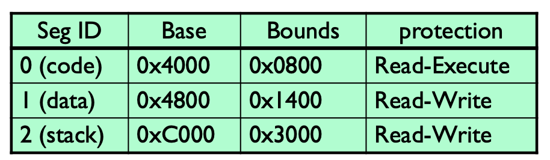

### Memory Allocation -- Linked Allocation

1. What are the 3 basic strategies for memory allocation? Explain the pros and cons of each.
    > 1. **Best fit**
    >    - Pros: Minimizes external fragmentation.
    >    - Cons: Exhaustive search, slow.
    > 2. **Worst fit**
    >    - Pros: Leaves larger holes.
    >    - Cons:
    >            - Exhaustive search, slow.
    >            - Severe external fragmentation.
    > 3. **First fit**
    >    - Pros: Faster allocation.
    >    - Cons: Pollutes the beginning of the free list with small chunks.

## VIII. Paging

### Page and Page Table

1. Explain the paging mechanism. The virtual address is devided into which 2 parts? Why don't we need a bound register in paging?
    > VirtualAdress = Page Number + Page Offset. VPN is used to index into the page table to get the corresponding PFN. Page offset is added to PFN to get the physical address. No bound register is needed because each page is of fixed size, so any offset within a page is valid.
    > 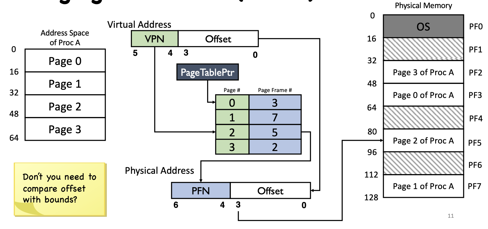

2. What are in the PTE (Page Table Entry)? Explain each field.
    > - **PFN**: Physical Frame Number
    > - **Valid bit**: Indicates a valid mapping. 0 indicate no PFN is mapped to this VPN.
    > - **Protection bits**: Read, write, execute permissions.
    > - **Accessed bit**: Indicates if the page has been accessed (for page replacement algorithms).
    > - **Dirty bit**: Indicates if the page has been modified (for write-back caching).
    > - **Present bit**: Indicates if the page is in physical memory or on disk. (for demand paging, part of the disk page is mapped to PTE)
    > 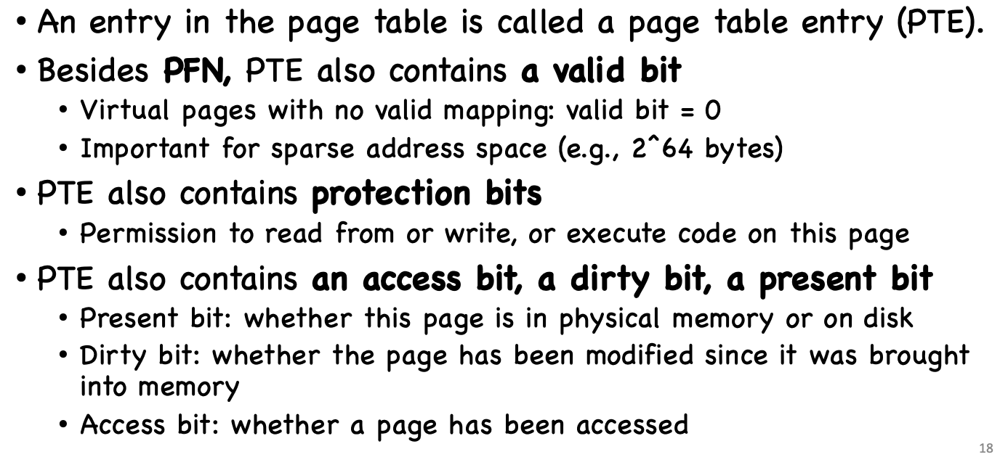

3. What are the issues of single-level page table?
    > 1. **Memory overhead**: Large page tables consume a lot of memory. e.g. 32-bit address space with 4KB pages requires 4MB page table per process.
    > 2. **Contiguous allocation**: Page table needs to be stored in contiguous memory, which can lead to fragmentation.
    > 3. **Fixed size**: Page table size is fixed at process creation, which may not be optimal for all processes.

### Multi-level Page Table

1. How is the number of bits of L1 / L2 page table index determined? (hint: each page table fits in one page)
    > Take SV39 as an example. Each page table fits in one page (4KB) and each PTE is 8 bytes. Therefore, each page table can hold 4096 / 8 = 512 entries, which requires 9 bits to index (2^9 = 512). In SV39, the virtual address is divided into 3 parts: 9 bits for L1 index, 9 bits for L2 index, and 12 bits for page offset.

2. How does multi-level page table save memory space?
    > The idea is like **pruning a tree**. Take 2-level page table as an example. If a process only uses a small portion of its virtual address space, many L2 page tables will not be needed. By using multi-level page tables, we only allocate memory for the L2 page tables that are actually needed, thus saving memory space.
    > 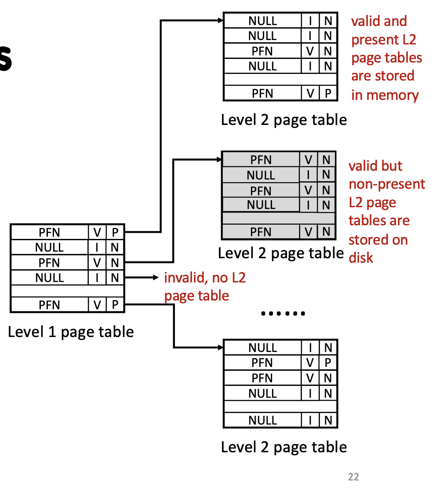

### Other Page Table Structures

1. Explain Inverted Page Table. What are the pros and cons?
    > Inverted Page Table (IPT) has one entry per physical frame, rather than per virtual page. The mapping is from PFN to (VPN, pid). Pid is needed to distinguish between different processes that may have the same VPN.
    > - Pros:
    >   - Reduces memory overhead for page tables, only one page table is needed.
    > - Cons:
    >   - Slower lookups: O(n) search through the IPT to find the corresponding (VPN, pid) pair.
    >   - No sharing of page tables between processes, each PFN is bound to a single (VPN, pid) pair.

2. Explain Hashed Page Table. What are the pros and cons?
    > Hashed Page Table uses a hash table to map VPN to PTE. The hash function takes the VPN and returns an index into the hash table. PTE is stored in linked lists at each index to handle collisions. PTE = (VPN, PFN, next pointer).
    > - Pros:
    >   - Faster lookups: O(1) average time complexity for lookups.
    > - Cons:
    >   - Collisions: Multiple VPNs may hash to the same index, requiring linked lists and may cause linear lookup time in worst case.
    >   - Memory overhead: Hash table may have unused entries, leading to wasted memory.

### SV39 & IA32

1. How many levels are there in SV39 page table? Why 9 bits are used for each level index? (hint: size of PTE is 8 bytes)
    > SV39 has 3 levels of page tables. Each level index uses 9 bits because each page table fits in one page (4KB) and each PTE is 8 bytes. Therefore, each page table can hold 4096 / 8 = 512 entries, which requires 9 bits to index (2^9 = 512).

2. Expalin the IA32 address translation mechanism. How many levels are there in IA32 page table? Explain the linear address.
    > - IA32 address translation: Virtual Address -> Linear Address -> Physical Address.
    > - Linear Address is obtained by segmentation unit (segment base + offset)
    > - Physical Address is obtained by paging unit (using 2-level page table)
    > - IA32 has 2 levels of page tables: Page Directory and Page Table. Each uses 10 bits for indexing. The physical address of page directory is stored in the CR3 register.
    > 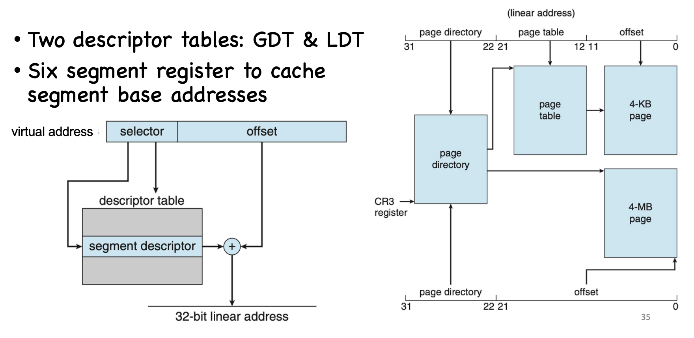

### TLB

1. Where is TLB located?
    > TLB is located in the MMU, as a hardware cache for PTEs.

2. What will happen during a TLB miss?
    > **Page table walk** is performed. 3-4 memory accesses are needed to fetch the PTE from the page table in memory which is slow.

3. Name the replacement policies for TLB. Explain each.
    > 1. **LRU (Least Recently Used)**: Replace the entry that has not been used for the longest time.
    > 2. **FIFO (First In First Out)**: Replace the oldest entry in the TLB.
    > 3. **Random**: Replace a random entry in the TLB.

4. What will happen to TLB during a context switch?
    > - The TLB is typically **flushed** during a context switch to prevent one process from accessing another process's memory. All the valid bit will be set to 0.
    > - Some architectures use **ASIDs (Address Space Identifiers)** to avoid flushing the TLB. During TLB lookup, (VPN, ASID) pair is used to identify the correct entry for the current process. 
    > 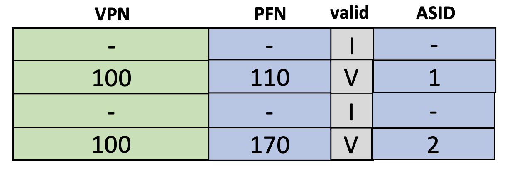

## IX. Demand Paging

### Demand paging mechanism

1. Who is responsible for moving data?
    > 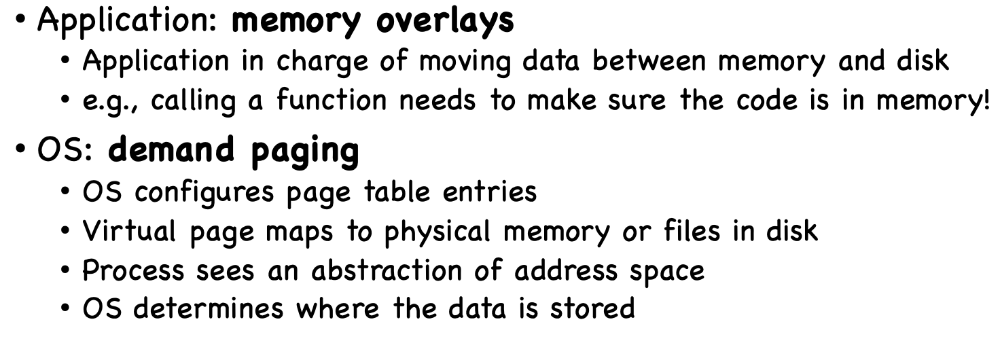

2. What is swap space?
    > Swap space is a partition or a file stored on the disk. OS swap pages between memory and swap space. Each page-sized unit in swap space can be
    addressed by the OS.

3. What will happen if the present bit is 0 during address translation?
    > Page fault.
    > 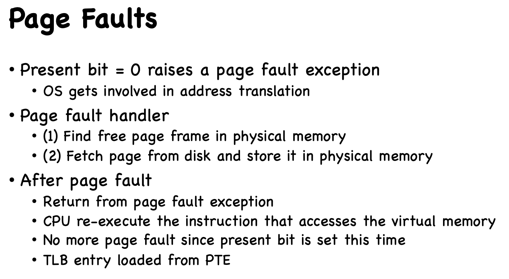
    > 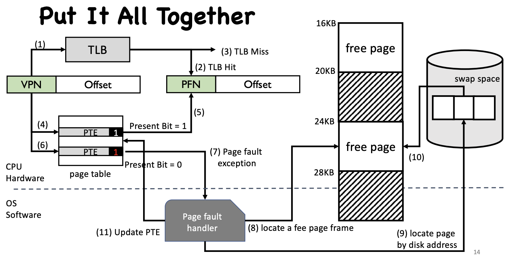

### Page Replacement Policy

1. How to calculate EAT (Effective Access Time)?
    > $$EAT = (1 - p) * memory\ access\ time + p * page\ fault\ time$$
    > where p is the page fault rate

2. What are the 3 types of cache misses? Explain each.
    > 1. **Compulsory miss**: When cache is empty, no cache line is valid. Therefor cache miss is compulsory. 
    > 2. **Capacity miss**: This indicates that increasing the size of cache will lower the cache rate.
    > 3. **Conflict miss**: Happens in n-way set associative cache. Address with the same index map to the same set. The data with the same index but different tags will evict each other even if there are empty lines in other sets.

3. Explain the following page replacement algorithms: MIN, FIFO, LRU, LFU.
    > - **MIN**: Optimal algorithm. Replace the page that will not be used for the longest time in the future. Not implementable in practice.
    > - **FIFO**: Replace the oldest page in memory. Simple but may evict frequently used pages.
    > - **LRU**: Replace the page that has not been used for the longest time. Approximates MIN.
    > - **LFU**: Replace the page that has been used least frequently.

4. What is Belady's anomaly? Which page replacement algorithms may suffer from it? Give an example.
    > Belady's anomaly is the counterintuitive situation where increasing the number of page frames results in an increase in the number of page faults. FIFO may suffer from Belady's anomaly.
    > Example:
    > Reference string: 1, 2, 3, 4, 1, 2, 5, 1, 2, 3, 4, 5
    > - With 3 frames: 9 page faults
    > - With 4 frames: 10 page faults

### LRU Implementation

1. Explain Clock-algorithm, Enhanced clock-algorithm, Nth-chance algorithm.
    > - **Clock-algorthm**: OS maintains a circular list of pages. A pointer (hand) sweeps through the list and repeatedly sets the reference (access) bit to 0.
    >   - if ref bit == 1: set to 0, move pointer forward
    >   - if ref bit == 0: stop pointer, candidate for eviction
    >
    > - **Enhanced clock-algorithm**: OS maintains both reference and dirty bits. Pointers traverse up to 4 rounds and will continue to the next round if current round fails. (1) look for (0,0) and replace, (2) look for (0,1) and replace, set ref to 0, (3) repeat (1), (4) repeat (2)
    >   (ref, dirty)
    >   - (0, 0): best candidate
    >   - (0, 1): not recently accessed but dirty
    >   - (1, 0): recently accessed
    >   - (1, 1): recently accessed and dirty
    >
    > - **Additional-reference-bits**: History register of 8 bits. Shift right the history reg periodically while setting MSB to the current ref bit, then set ref to 0. The page with the smallest history is evicted.
    > (ref, history)
    > page1: (1, 01001101) -> (0, 10100110)
    > page2: (0, 00100101) -> (0, 00010010)
    > evict page2
    >
    > - **Nth-chance algorithm**: Similar to clock algorithm, but each page has a counter. Increasing N => better approximation of LRU.
    >   - ref=1: cnt := 0
    >   - ref=0: cnt++ on hand sweep.
    >   - cnt == N, stop pointer and evict

### Frame Allocation

1. Explain the difference between global replacement and local replacement.
    > - **Global replacement**: A page fault in one process can evict a page from another process. More flexible, but may lead to thrashing.
    > - **Local replacement**: Each process has its own fixed number of frames. A page fault can only evict pages from the same process. Less flexible, but prevents thrashing between processes.

2. Explain the allocation algorithms: Equal allocation, Proportional allocation, Priority allocation.
    > - **Equal allocation**: same number of pages
    > - **Proportional allocation**: $n_i = (s_i / \sum s_j) * N$
    > - **Priority allocation**: higher priority process may get frame from lower priority process.

3. Explain Thrashing. Why is thrashing a problem? How to solve thrashing?
    > - **Thrashing**: memory demands exceed physical memory
    > - **Problem**: CPU busy replacing pages, low CPU utilization
    > - **Solution**:
    >   - early OS: working set, reduce number of processes to make working set fit in memory
    >   - modern OS: out-of-memory killer, need reboot

## X. Linux Memory Management

### Address space in linux

1. Linux virtual address space is divided into which 2 parts? Explain each part.
    > - **User space**: Switchable between processes.
    > - **Kernel space**: Universal across all processes.

2. Why is kernel memory mapped into the address space of each process?
    > - No need to switch page table or flush TLB when trapping into kernel mode.
    > - Kernel can access user space memory when needed.

3. Explain the difference between kernel logical address and kernel virtual addresses.
    > - **Kernel logical address**: Physically contiguous.
    > - **Kernel physical address**: Virtually continuous, physically discrete.

4. How to protect kernel space from user space access?
    > Set the U bit to 0 in the PTE.

### Large Page

1. Explain large page. What are the pros and cons?
    > L1 / L2 / L3 PTE points to a large page rather than the next layer page table, enabling large page (e.g., 2MB or 1GB instead of 4KB).
    > - Pros:
    >   1. Reduces TLB misses
    >   2. Applications may need physically continuous physical memory
    > - Cons:
    >   1. Internal fragmentation:

2. How to support large page in different ISA?
    > |架构|判定|逻辑描述|
    > |---|---|---|
    > |x86-64|PS 位|专门的一位用于标识“在此处停止并作为大页”|
    > |RISC-V|R/W/X 权限位|如果该项可读、可写或可执行，它就是页，否则指向下级表|
    > |ARM64|Type Bit|使用 PTE 的低两位（01=大页/Block, 11=下级表/Table）|

### Slab Allocator

1. Draw a diagram to explain the relationship among cache, slabs, and objects.
    > 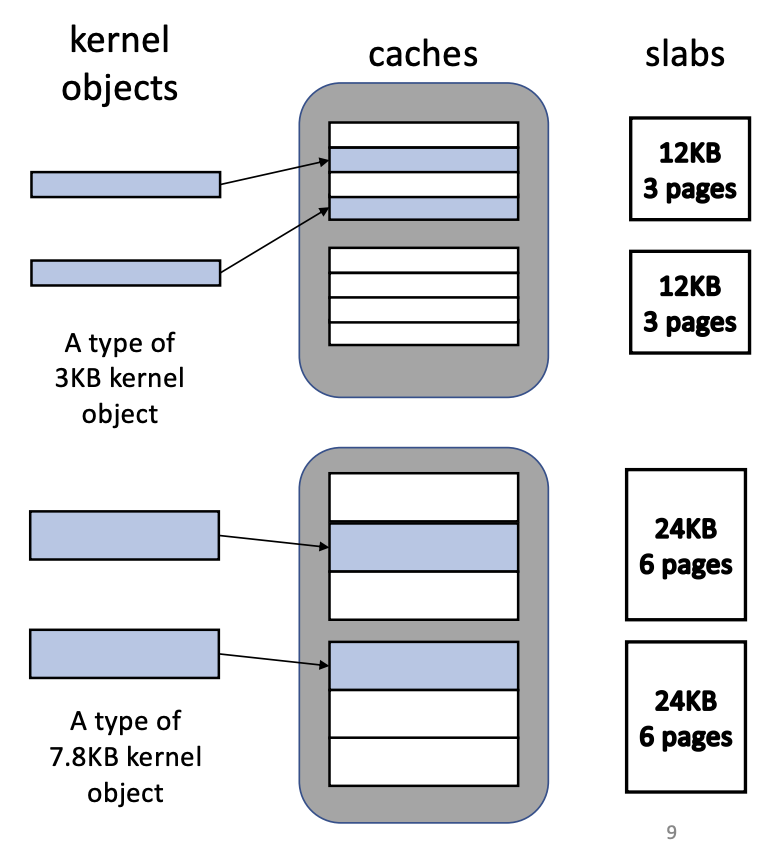

2. What are the states of a slab? How does a slab allocator handle allocation and deallocation of objects?
    > - **Full**: All objects are allocated.
    > - **Partial**: Some objects are allocated, some are free.
    > - **Empty**: All objects are free.
    >
    > - **Allocation**: Find a partial slab, allocate an object from it. If no partial slab exists, create a new slab.
    > - **Deallocation**: Free the object, if the slab becomes empty, it can be returned to the system.

### Buddy System

1. Expalin the allocation and deallocation mechanism of buddy system.
    > - **Allocation**: Find the smallest block which satisfies the request if presented. Otherwise split a larger block into two buddies until the requested size is met.
    > - **Deallocation**: Free the block, check if its buddy is also free. If so, merge them into a larger block. Repeat until no more merging is possible.

2. How to find the buddy of a block?
    > The buddy of a block can be found by flipping the k-th bit of the block's starting address, where k is the order of the block (i.e., size = 2^k).

## XI. IO and Storage

### Device

1. What are the 3 buses in a computer system?
    > 1. Memory bus: super fast
    > 2. IO bus: fast
    > 3. Peripheral bus (PCI): slow

2. Explain the hardware interface of a device. (status, command, data registers)
    > View of device for the other part of the system (CPU, OS)
    > - status register: read-only, ready/busy, error ...
    > - command register: write-only
    > - data register: read/write data

### IO Operations

1. Expalin polling.
    > CPU repeatedly checks the status register of the device to see if it's busy. If not, CPU sends data and command to the device. Simple but wastes CPU cycles.

2. Expalin interrupt.
    > Device sends an interrupt signal to the CPU when it is ready for data transfer. CPU saves its state and jumps to the interrupt handler to process the device request.

3. How to decide between polling and interrupt?
    > - Fast device: Polling
    > - Slow device: Interrupt
    > - Somtime fast sometimes slow: Hybrid approach (poll for a short time, then use interrupt)

4. Explain PIO. What are the drawbacks of PIO?
    > CPU is responsible for data transfer between memory and device.
    > Drawbacks: Wastes CPU cycles

### More on interrupts

1. What are the hardware support for interrupts?
    > 1. Interrupt-request line
    >    - check interrupt signal after each instruction
    >    - save CPU state, jump to interrupt handler
    > 2. Interrupt-control hardware:
    >    - delay interrupts (prevent thrashing)
    >    - dispatch interrupts to proper handler
    >    - prioritize interrupts

2. What are the software support for interrupts?
    > 1. Interrupt handler
    >    - maskable vs non-maskable interrupts
    > 2. Interrupt vector table (Think of a hash table of ISR)
    >    - Chaining: multiple handlers per interrupt
    >    - Dispatch: interrupt go to proper handler
    >    - Priority: high preempts low

### DMA and drivers

1. Explain how DMA works.
    > - DMA confronts drawbacks of PIO.
    > - Process:
    >     1. Prepare & notify: CPU write DMA command block to memory then notify DMA controller. (src&dst address, data size, command(read/write))
    >     2. Bus mastering: DMA controller takes over the bus.
    >     3. Data transfer: DMA controller copy data by cycle stealing.
    >     4. Interrupt: DMA controller interrupts CPU when done.

2. Draw a diagram of DMA data copy from memory to disk.
    > 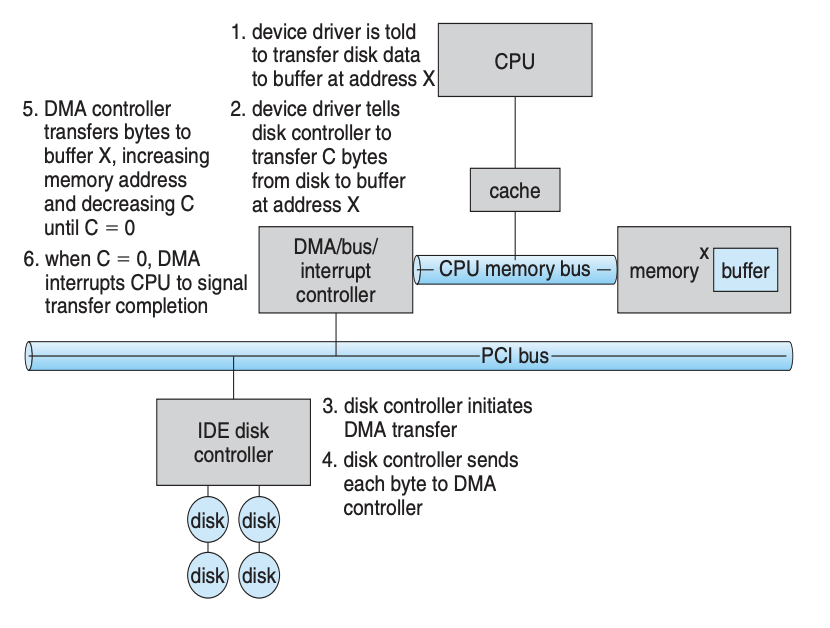

3. Explain the top half and bottom half of device driver.
    > - Top half: interface to the OS.
    >   - trigger: generic API (open(), read(), write(), close())
    >   - synchronous: in process context
    >   - start IO
    >   - call sleep()
    > - Bottom half: interface to the device.
    >   - trigger: hardware interrupt
    >   - asynchronous, in interrupt context
    >   - device specific, get input or move next block of output
    >   - call wakeup(), cannot be blocked

---

### Storage

1. What are the differences between magnetic disk and SSD?
    > - Magnetic disk: lower cost per GB, higher capacity, slower access time
    > - SSD(Solid State Drive): higher cost per GB, lower capacity, faster access time, no mechanical parts

2. Explain the structure of a magnetic disk.
    > - Platters: circular disks coated with magnetic material, each platter has 2 surfaces.
    > - Tracks: concentric circles on each surface. About 1e-6 m wide.
    > - Sectors: subdivisions of tracks, smallest unit of data transfer.
    > - Cylinders: set of tracks located at the same radius on all platters.

3. Explain the three-stage process of magnetic disk data read/write.
    > 1. Seek time: move the read/write head to the correct track.
    > 2. Rotational latency: wait for the desired sector to rotate under the head.
    > 3. Transfer time: read/write the data from/to the sector.

4. What is the whole disk latency consist of?
    > whole disk latency = sw queueing time + hw controller time + seek time + rotational latency + transfer time
    > 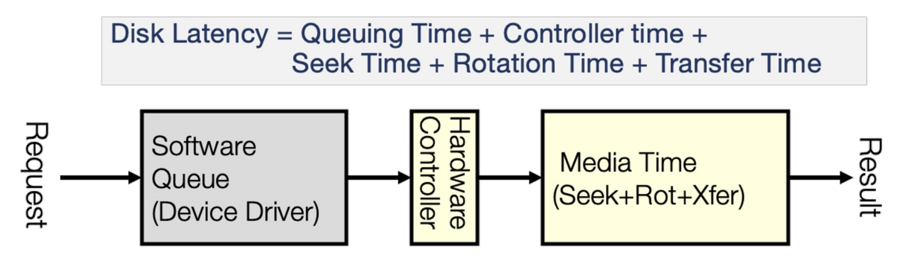

5. Assume avg seek time = 5ms, rotational speed = 7200 RPM, transfer rate = 4 MB/s, sector size = 1 KB. What are the avg time reading a sector when 1) random place read 2) same cylinder read 3) next sector read?
    > avg rot delay = 60000 / 7200 / 2 ~= 4ms (half rotation)
    > avg transfer time = 1KB / 4MB/s = 0.25ms
    > 1) random place read = seek time + rot delay + transfer time = 5 + 4 + 0.25 = 9.25ms
    > 2) same cylinder read = rot delay + transfer time = 4 + 0.25 = 4.25ms
    > 3) next sector read = transfer time = 0.25ms

### Disk Scheduling

1. What's the purpose of disk scheduling?
    > Minimize seek time by minimize the seek distance.

2. How to minimize the total head move distance?
    > Minimize number of cylinders.

3. Explain FIFO, SSTF.
    > - **FIFO**: Process requests in the order they arrive. Starvation.
    > - **SSTF (Shortest Seek Time First)**: Select the request with the shortest seek time from the current head position. Starvation for farther requests.

4. Explain SCAN, C-SCAN.
    > - **SCAN**: Arm moves in one dirction, process requests as it goes, as it reaches the end, it reverses direction process request as it goes backwards. Starvation for reverse end requests.
    > - **C-SCAN (Circular SCAN)**: Arm moves in one direction, process requests as it goes, as it reaches the end of physical disk, it jumps back to the beginning without processing, repeats. Fairer than SCAN. Also note that jump back time is ignored.

5. Explain LOOK, C-LOOK.
    > - **LOOK**: Similar to SCAN, but the arm only goes as far as the last request (rather than physical end) in each direction before reversing. Reduces unnecessary travel.
    > - **C-LOOK (Circular LOOK)**: Similar to C-SCAN, but the arm only goes as far as the last request before jumping back to the beginning. Reduces unnecessary travel.

## XII. File System

### Componentes & View

1. What are the 4 components of a file system?
    > - Naming
    > - Disk management
    > - Protection
    > - Reliability

2. What are the view of a file from User, System call, OS, Hardware?
    > - User view: Durable data structure
    > - System call view: collection of bytes
    > - OS view: collection of blocks
    > - Hardware view: collection of sectors

### Disk Management

1. Expalain the entities in disk management.
    > - File: group of sequential blocks.
    > - Directory: mapping: name -> file

2. Explain LBA.
    > - Logical Block Addressing: 1-D array of blocks.

3. Explain bitmap for free block management.
    > - Each bit represents a block on disk.
    > - 0: free, 1: allocated.

4. Explain file header for file structuring.
    > - Record which block -> which file offset.

### Layout & Allocation

1. What should directory entry record?
    > - Filename
    > - First block
    > - File size
    > - Other file attributes

2. Explain contiguous allocation. What are the problems?
    > - Each file occupies a set of contiguous blocks on disk.
    > - Problems:
    >   1. External fragmentation
    >   2. File deletion may lead to de-fragmentation which is slow
    >   3. Difficult to grow files

3. Explain linked allocation. What are the problems?
    > - Chop down file into fix sized blocks. Each file is a linked list of blocks, each block contains a pointer to the next block.
    > - Problems:
    >   1. Internal fragmentation
    >   2. Poor random access (O(n) time)
    >   3. Reliability: if a pointer is lost, the rest of the file is lost.

4. How does FAT facilitate random access compared to linked allocation?
    > - File Allocation Table (FAT): table of block pointers. Still O(N) time, but faster since no need to load the entire block into memory to get the next pointer.

### More on FAT

1. Expalain 8 + 3 naming convention. What is the 1st byte of directory entry used for?
    > - 8 + 3 naming convention: 8 characters for filename, 3 characters for extension. (explorer.exe)
    > - 1st byte of directory entry:
    >   - 0x00: unused entry
    >   - 0xE5: deleted file
    >   - other values: valid entry

2. How to support LFN(Long file name) in FAT?
    > - Use multiple directory entries for a single file.
    > - Each LFN entry can store up to 13 Unicode characters.
    > - 1st byte of LFN entry: sequence number. The terminating directory entry has the sequence number OR-ed with 0x40.
    > - 11th byte of LFN entry: 0x0F to indicate LFN entry.
    > - The last entry is the standard 8+3 entry.

3. Explain appending a file in FAT.
    > 1. Find the last cluster of that file.
    > 2. Write to last cluster until full.
    > 3. Find next free cluster using FSINFO sector.
    > 4. Update FAT and FSINFO (free cluster num, next free cluster).
    > 5. Update file size in directory entry.

4. Explain deleting a file in FAT.
    > 1. Mark the directory entry's first byte as 0xE5.
    > 2. Traverse the FAT from the file's first cluster, marking each cluster as free (0x0000) until reaching the EOF marker (0xFFFF).

5. Why is it possible for us to recover file in FAT?
    > - Deleting a file does not delete the actual data cluster until it gets overwritten.
    > - Next free cluster pointer is a next available search, searching contiguously may find the deleted file's clusters.

### INode Allocation

1. What are the entities in Inode allocation?
    > - Inode
    > - Block (direct, single-indirect, double-indirect, triple-indirect)

2. What is the structure of Inode?
    > - Metadata: file type, permissions, owner, group, size, timestamps etc.
    > - Pointers: 15 total, 12 direct, 1 single-indirect, 1 double-indirect, 1 triple-indirect.

3. What is stored in indirect block?
    > Array of block numbers (pointers).

4. Suppose block size = 4KB, block number size = 4 bytes, what is the max file size supported by Inode structure?
    > - Direct blocks: 12 * 4KB = 48KB
    > - Single-indirect block: 4KB / 4B * 4KB = 4MB
    > - Double-indirect block: (4KB / 4B) * (4KB / 4B) * 4KB = 4GB
    > - Triple-indirect block: (4KB / 4B) * (4KB / 4B) * (4KB / 4B) * 4KB = 4TB
    > - Total max file size = 48KB + 4MB + 4GB + 4TB ~= 4TB

### Ext2/3/4

1. Describe the structure of block group in Ext 2/3.
    > - System universal data: superblock (system metadata), GDT(group descriptor table, each entry record the start block of bitmaps and inode table of the whole system)
    > - Group unique data: block bitmap, inode bitmap, inode table, data blocks

2. How does ext 2/3 ensures performance and reliability using block group?
    > - Performance: spatial locality, group related files together in a group.
    > - Reliability: every block group maintains a copy of superblock and GDT.

3. How does ext 2/3 facilitate file deletion?
    > - The directory entry has dynamic length, thus each entry shall record its length.
    > - When deleting a file, simply extend the lenght of the previous entry to cover the deleted entry.

4. How is hard link implemented in ext 2/3?
    > - Create a new directory entry pointing to the same inode as target.
    > - Increment the link count in the inode.

5. How does pathname length effect symbolic link implementation?
    > - If pathname length <= 60 bytes, store the pathname directly in the inode (15 pointers field).
    > - If pathname length > 60 bytes, allocate a new block, store the pathname in it.
